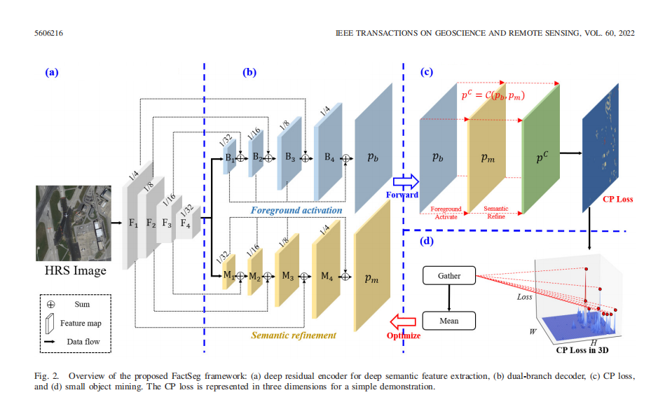

# FactSeg (Implemented by PaddlePaddle 2.3)

## 1. 简介
为了解决在遥感图像中仅占几个像素的小物体检测问题，作者提出了Fact-Seg语义分割网络。该网络首次从结构和优化器
角度提出了前景激活（FA）驱动的小物体语义分割框架，增强了网络对小物体弱特征的感知能力。该模块由对偶解码器分支（FA）和联合
概率损失（CP）组成，其中对偶解码器中的FA模块用于激活小物体特征并抑制大尺度的背景，语义分割（SR）微调分支模块用于进一步区分
小物体。此外，作者还提出了小物体在线挖掘模块，用于解决小物体和背景之间的样本不平衡问题。该方法在两个遥感图像
数据集中取得了SOTA的成绩，并且在精度和速度之间取得了很好的平衡。



**论文：** [FactSeg: Foreground Activation-Driven Small
Object Semantic Segmentation in Large-Scale
Remote Sensing Imagery](https://ieeexplore.ieee.org/document/9497514)

**参考repo：** [Wang: FactSeg](https://github.com/Junjue-Wang/FactSeg)

在此非常感谢 [Wang](https://github.com/Junjue-Wang/FactSeg) 等人贡献的FactSeg项目，提高了本repo复现论文的效率。项目已上传到[AI studio](https://aistudio.baidu.com/aistudio/projectdetail/4632057?sUid=711344&shared=1&ts=1665137667176)上，
可使用32G显存部署后台任务训练。若在本地训练，请对数据集路径，预训练权重路径的文件进行相应更改。请forkV_2_1版本。若部署后台任务，请先全选全部项目，再删除Step1_5文件夹, final.zip文件，RaddleRS.zip, RaddleRS文件夹，并选择train.ipynb作为执行文件。其他版本将会导致文件无法运行。


# 2. 数据集和复现精度

- 航空图像数据集iSAID—语义分割部分：[https://captain-whu.github.io/iSAID/index.html](https://captain-whu.github.io/iSAID/index.html)

复现精度如下。

| method         | iters | bs   | card | loss      | align_corners | mIoU    |
|----------------| ----- | ---- | ---- |-----------| ------------- |---------|
| official_code  | 60k   | 4    | 2    | JointLoss | √             | 64.79   | 
| ours_60k       | 60k   | 8    | 1    | JointLoss | √             | 64.79   | 
| official_paper | 20k   | 4    | 1?   | JointLoss | √             | 64.79   | 
| ours_10k       | 10k   | 8    | 1    | JointLoss | √             | 64.79   | 

关于模型验证指标，尽管官方代码的训练次数为60k，但是根据对每5000迭代保存的模型进行测试，发现模型在训练10k时，就已经达到64.79的指标了，与论文提到的训练20k迭代一致，由于论文没有提到GPU数量，猜测可能为单GPU，
如果想要快速验证，可训练10k以上迭代次数后，测试第10k时保存的模型即可，模型进行10k次迭代大约需要8-10小时左右。模型迭代60k大约需要2天左右。训练和测试日志保存
在Log文件夹下。


## 3. 准备数据与环境

### 3.1 准备环境

- 环境：AI Studio & BML CodeLab & Python 3.7；
- 硬件：Nvidia Tesla V100 32G × 1；
- 框架：PaddlePaddle 2.3.2；

```jupyter
!pip install scikit-image
!pip install reprod_log
!pip install paddleseg
!pip install pillow
%cd /home/aistudio/
!mkdir output
%cd /home/aistudio/data/data170962
!mkdir train test
%cd /home/aistudio/data/data170962/train
!mkdir images masks
%cd  /home/aistudio/data/data170962/test
!mkdir images masks
%cd /home/aistudio/
```

### 3.2 解压数据

训练和评估所需数据为iSAID数据集的语义分割任务部分。

图像可以在 <a href="https://captain-whu.github.io/DOTA/dataset.html" target="_blank">DOTA-v1.0</a> (train/val/test)下载，标注可在 <a href="https://captain-whu.github.io/iSAID/dataset.html" target="_blank">iSAID</a> (train/val)下载。

对于下载完成的原始iSAID数据集，使用如下命令进行解压
```jupyter
!unzip -d /home/aistudio/data/data170962/train/images /home/aistudio/data/data170962/part1.zip
!unzip -d /home/aistudio/data/data170962/train/images /home/aistudio/data/data170962/part2.zip
!unzip -d /home/aistudio/data/data170962/train/images /home/aistudio/data/data170962/part3.zip
!unzip -d /home/aistudio/data/data170962/train/masks /home/aistudio/data/data170962/seg_train.zip 
!unzip -d /home/aistudio/data/data170962/test/images /home/aistudio/data/data170962/val_image.zip
!unzip -d /home/aistudio/data/data170962/test/masks /home/aistudio/data/data170962/seg_val.zip
```

按照如下结构在根目录进行准备进行准备：

```diff
├── data
 └── data170962
     ├── train
     │   ├──images
     │   │   └── images
     │   └──masks
     │       └── images
     └── test
         ├──images
         │   └── images
         └──masks
             └── images

```

- [AI Studio: iSAID](https://aistudio.baidu.com/aistudio/datasetdetail/170962/0) ；
- 数据格式：图片为RGB三通道图像，标签为单通道图像，值为INT[0,15]+{255}，二者均为PNG格式存储；


## 4. 开始使用

### 4.1 模型训练

主要训练配置如下：

-   模型训练步长60000，单卡训练批大小设为8；
-   优化器：Momentum（momentum=0.9, weight_decay=1e-4, clip_grad_by_norm ）；
-   学习率策略：多项式衰减PolynomialDecay（begin=0.007，end=0.0, power=0.9）；

下载转换得到的ResNet50预训练权重，保存在`/home/aistudio/data/data170962/resnet50_paddle.pdparams`或者手动更改/home/aistudio/simplecv1/module/_resnet.py
下的resnet state路径，若打印出”Loading model Resnet50“，则加载成功。这里请确保打印出Loading model Resnet50，否则可能会影响最终精度。
参数中的image_dir和mask_dir设置的是测试集的输入图像和分割图像路径；如果要更改训练集路径，请更改`configs/isaid/factseg.py`中的data.train.params.image_dir 和
mask_dir参数。如果AI studio长期不显示打印信息，可能是训练集的路径设置错误导致的。

开始训练，单GPU自动混合精度。

```jupyter
config_path='isaid.factseg'
ckpt_path='/home/aistudio/data/data170962/fact-seg_temp.pdparams'
image_dir='/home/aistudio/data/data170962/test/images/images'
mask_dir='/home/aistudio/data/data170962/test/masks/images'
resume_model_path=''
!python  apex_train.py \
    --config_path={config_path} \
    --ckpt_path={ckpt_path} \
    --image_dir={image_dir} \
    --mask_dir={mask_dir} \
    --patch_size=896\
    --resume_model_path={resume_model_path}\
    --resume_iter=0
```

### 4.2 模型评估

训练时未进行评估，待训练完成后单独对已保存模型进行评估，并写入日志，选择验证集最优模型。

```jupyter
config_path='isaid.factseg'
ckpt_path='/home/aistudio/data/data170962/fact-seg_temp.pdparams'
image_dir='/home/aistudio/data/data170962/test/images/images'
mask_dir='/home/aistudio/data/data170962/test/masks/images'

!python isaid_eval.py \
    --config_path={config_path} \
    --ckpt_path={ckpt_path} \
    --image_dir={image_dir} \
    --mask_dir={mask_dir} \
    --patch_size=896
```

以下内容中，单独对本repo训练好的最优权重进行评估。

FactSeg权重文件和ResNet50预训练权重，请在[百度网盘](https://pan.baidu.com/s/1wI7OjqIkrBvo6gv55GSKyg)下载，密码为`st5l`或直接在AI studio中下载。


## 5. 模型推理部署
从之前的[百度网盘](https://pan.baidu.com/s/1wI7OjqIkrBvo6gv55GSKyg)链接下载PaddleRS.zip，并解压PaddleRS.zip文件夹
这里手动生成了`PaddleRS/normal_model/model.yml`，其中包含了使PaddleRS成功调用模型的参数。

FactSeg模型迁移在这里 [PaddleRS/paddlers/rs_models/seg]。

将工作目录切换到`Fact-Seg-master/PaddleRS`。然后安装依赖，拷贝[4.2]小节下载的权重，导出部署模型。
这里如果在本地部署还需要更改`/PaddleRS/paddlers/rs_models/seg/backbone/_resnet.py`下的预训练权重路径
```jupyter
%cd /home/aistudio/PaddleRS
!pip install -r requirements.txt
!python setup.py install
```

```jupyter
%cd /home/aistudio/PaddleRS
!cp /home/aistudio/data/data170962/factseg50_paddle.pdparams normal_model/model.pdparams
!python deploy/export/export_model.py --model_dir=normal_model --save_dir=inference_model --fixed_input_shape [None,3,896,896]
```

运行动态图、静态图的加载与预测，可视化图像保存在`/PaddleRS/infer_test/`。

```jupyter
!python infer_test/infer.py
```


## 6. TIPC测试

- 模式1：lite_train_lite_infer，使用少量数据训练，用于快速验证训练到预测的流程是否能走通，不验证精度和速度；

```jupyter
!pip install  https://paddleocr.bj.bcebos.com/libs/auto_log-1.2.0-py3-none-any.whl
!bash ./test_tipc/prepare.sh test_tipc/configs/seg/farseg/train_infer_python.txt lite_train_lite_infer
```

这里由于AI Studio上无法安装遥感图像读取库gdal，请在本地运行PaddleRS中sh文件进行测试，整个测试约耗时5min左右，该项目
没有在多卡上测试，尽在本地单卡12G上测试成功。

```jupyter
!bash ./test_tipc/test_train_inference_python.sh test_tipc/configs/seg/farseg/train_infer_python.txt lite_train_lite_infer
```

TIPC测试日志文件保存于之前的[百度网盘]链接(https://pan.baidu.com/s/1wI7OjqIkrBvo6gv55GSKyg)中，密码为st5l 。


```jupyter
!bash ./test_tipc/test_train_inference_python.sh test_tipc/configs/seg/farseg/train_infer_python.txt lite_train_lite_infer
```
### Ubuntu 系统安装gdal
```jupyter
conda install -c conda-forge gdal=3.4.1
```
#### 报错一

```py
gdalinfo: /home/pg/anaconda3/envs/abcNet/bin/../lib/./libstdc++.so.6: version `GLIBCXX_3.4.30' not
found (required by /home/pg/anaconda3/envs/abcNet/bin/../lib/./libtiledb.so.2.2)
```
#### 解决方案
```py
conda install -c conda-forge gcc=12.1.0
```
#### 报错二
```py
ImportError: libtiledb.so.2.2: cannot open shared object file: No such file or directory
```
#### 解决方案
```py
ln -s /home/XX/anaconda3/envs/torch17/lib/libtiledb.so.2.3 /home/XX/anaconda3/envs/torch17/lib/libtiledb.so.2.2
```
#### 报错三
```py
GDAL import fails with ImportError: libpoppler.so.71: cannot open shared object file: No such file or directory
```
#### 解决方案
```py
conda install "poppler<0.62"
```
## 7. LICENSE

本项目的发布受 [Apache 2.0 license](https://github.com/ucsk/FarSeg/blob/develop/LICENSE) 许可认证。

## 8. 参考链接与文献

- 论文： <a href="https://ieeexplore.ieee.org/abstract/document/9497514" target="_blank">FactSeg: Foreground Activation-Driven Small Object Semantic Segmentation in Large-Scale Remote Sensing Imagery</a>
- 代码： <a href="https://github.com/Junjue-Wang/FactSeg" target="_blank">FactSeg (Junjue-Wang
)</a> 、 <a href="https://github.com/ucsk/FarSeg" target="_blank">FarSeg (DeepRS)</a>
